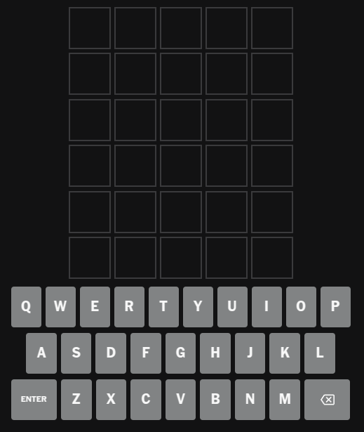
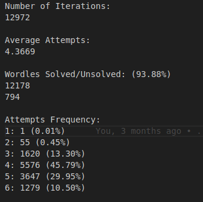
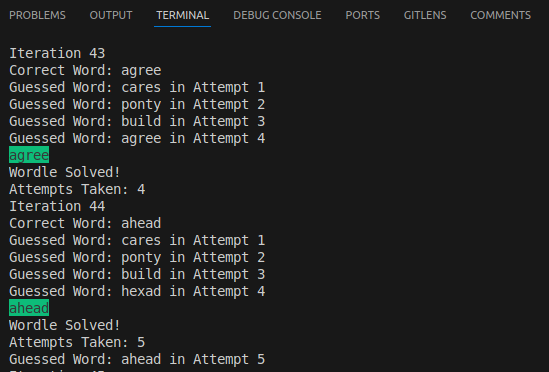

**Notes**
The program currently doesn't support any interactions with the user, only the wordle game and the solver interact with each other.
A version where the user can interact with the solver to get help finding the correct word will be introduced soon.

**Wordle**
Wordle is a famous game in which a random 5 letter word is chosen from a select dictionary and the player (in this project, the solver)
has 6 attempts to figure out the word using information given to him from the previous attempts.

In the 1st attempt, the player has no information about the correct word

After the player chooses and inputs a word, the wordle game compares each letter of the guessed word to the correct word:
 - if a letter is grey, then it isn't in the word at all (if the same letter is green or yellow elsewhere in the word, it's in fact in the word, 
   but you already found all instances of that letter)
 

 - if a letter is yellow, then it's in the word, but not in the correct position
 
 (notice that in this example, there's a grey A and a yellow A, meaning there is only 1 A in this word, like we discussed before)

 - if a letter is green, then it's in the word and in the correct position
 

 - if the player guessed the correct word (i.e all the letters are green), then he wins the game

In the context of this project, there are 12972 words in the dictionary (the same dictionary used in the original game), and the player can only choose words
that exist in that dictionary. All words are in English and contain 5 letters.
The colour of the letters (grey, yellow, green) are represented by numbers to facilitate communication (0, 1 and 2 respectively)

**Preparation for the Solver**
Some statistics and data analysis is made before we can actually start to solve the wordles, the first time the program is run:
The find_letter_probs.py program iterates through each word of the dictionary, and counts, for each letter of the alphabet, how many times it appears in the dictionary
and how many times it appears in the different positions of the word. These are called the letter frequencies.
To find the main letter probabilities, we simply divide each count by the total number of letters in the dictionary (number of words * number of letters in a word).
For the letter position probabilities, we only divide each count for each position by the number of letters in that position (which will be the number of words).

Then, prob_finder.py will use these probabilities to calculate the words that contain the most probable letters possible.
It does this by attributing a score for each word, and then sorting them based on the highest scores.
The score is calculated by iterating through every letter of the word, and for each letter, multiplying both its probabilities by weights varying between 0 and 1 (LETTER_PROBS_WEIGHT for the main probability and LETTER_POS_WEIGHT for the position probability), adding them together, and summing the result to the results of the other letters.
Testing with different configurations, I found that using LETTER_POS_WEIGHT = 0 actually performs the best, giving us the highest solved rate of any possible value for this weight. This means that the probabilities of each letter based on its position not only serve basically no purpose, it also hinders our performance!

Now that we have our sorted list of words based on their probabilities (words_prob_dup.txt), we can actually remove the words that contain duplicate letters (i.e two or more instances of the same letter).
Since this new list (words_prob_nodup.txt) only includes words with all different letters, then the first word in that list is the best word to start our 1st attempt with,
as this gives us the better odds of finding the most amount of different letters in the correct word.

**Solver Algorithm**
After all the preparation, we are finally ready to start solving.
The solver begins by sending through the wordle_pipe.txt its 1st guess (which is the 1st word in wordle_probs_nodup.txt) and then waits for the wordle to respond.
The wordle will return each letter of the word followed by a number representing its colour. For example:
c0a2r0e1s0
This indicates the letter 'a' is in the correct word in that position (green), 'e' is in the word but in the incorrect position (yellow) and none of the other letters are in the word (grey).

The algorithm uses this information to exclude words from its list of possible words. 
In this example, it will remove:
 - every word that contains 'c', 'r' and 's'
 - every word that doesn't have an 'a' in the 2nd position
 - every word that doesn't have an 'e'
 - every word that has an 'e' in the 4th position

The list of possible words is sorted based on the probabilities, so the solver's next guess will be the first word in the list.

The solver will repeat this until either it guesses the correct word and wins the game, or it uses its 6 attempts, by which point it already lost.

**Statistics**
After each time the program runs, the statistics of the run will be stored in new_stats.txt and then combined to the full record of statistics of the project found in stats.txt.
The stats files include some fun statistics and analysis, but the most important stat is the Wordles Solved/Unsolved. This stat gives us some insight as to how many wordles were solved and how many weren't followed and the solved rate.

The highest solved rate achieved in this project is 93.88%, meaning that it can solve 12178 out of 12972 wordles!

**Bugs**
If the user interrupts the program during its execution, iters.txt will not reset back to 1 automatically. If it's not manually put to 1 before the next execution, the program will break eventually.

**Using the Config**
*PRINTS_ENABLED*
If set to False, the program will only print to the terminal the iteration which is currently on.
If set to True, further insight into the performance of the program and a better visual will be seen on the terminal.

*TEST_MODE_ENABLED*
If set to False, the correct word will be picked randomly by wordle.py from the wordle dictionary and the user can insert in N_ITERATIONS how many wordle games it wants the program to play.
If set to True, wordle.py will iterate through the whole dictionary in order. It iterates through the 12972 words, so the user can't choose an arbitrary number of iterations.
This is useful for consistency reasons for the solved rate and the time it took to execute the program.

**Running the Program**
To execute the program, you need to have Python installed. The version used in this project is Python 3.13.
Open a terminal in the root directory and run the command:
Ubuntu/MacOS:
python3 wordlesolver.py

Windows:
python wordlesolver.py

**Checking Results**
The results for the execution of the program can be found in data/stats/new_stats.txt.

**Project Structure**
*root*
wordlesolver.py - found in the root directory, it executes the solver and the wordle programs and gathers data from their execution

*data*
/database - includes the list of words in the wordle dictionary

/probs - files associated with probabilities
/probs/probs.txt - probability of guessing a letter based on it's frequency as well as it's frequency in a certain position of the word
/probs/words_prob_dup.txt - the words in the dictionary sorted based on their probability
/probs/words_prob_nodup.txt - same as the last file, but removed all words that contain duplicate letters

/stats - statistics gathered throughout the execution of a cycle (i.e executing the program for either all the words or a select amount) and in the program's history

/words_to_fix.txt - list of unsolved words gathered during a cycle

*src*
/config - configuration file which includes booleans, constants, some global variables and paths

/main/wordle.py - simulates a real wordle game 
/main/solver.py - uses an algorithm to solve the wordle
both programs are executed at the same time and interact with each other through various files (pipes) found in utils/helpers

/utils/functions - includes programs for data gathering and analysis and other functions used throughout the whole project

/utils/helpers - files used by the wordle and solver programs to communicate
/utils/helpers/wordle_pipe.txt - file used for communication between the wordle and the solver
/utils/helpers/iters.txt - stores the current iteration which is used by wordle.py to know what iteration it is currently on
/utils/helpers/results.txt - stores the result of each individual game (the word and the number of attempts the solver took to guess it (0 if it didn't guess it)), which wordlesolver.py will use for statistics.

benchmarking.txt - log in which I recorded some optimizations and fixes I did to the project during my time working on it.
Here, you can find the effects of the optimizations on time efficiency of the program as well as the effects of the fixes in both time efficiency and the solved rate.
As a summary:
Without any optimizations, the program would have taken an estimated 11h37m to completely iterate through the entire dictionary (12972 words).
After my latest optimization (and some fixes), it now takes roughly 9m5s to finish (~7700% speedup!).

